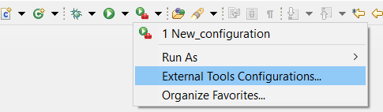
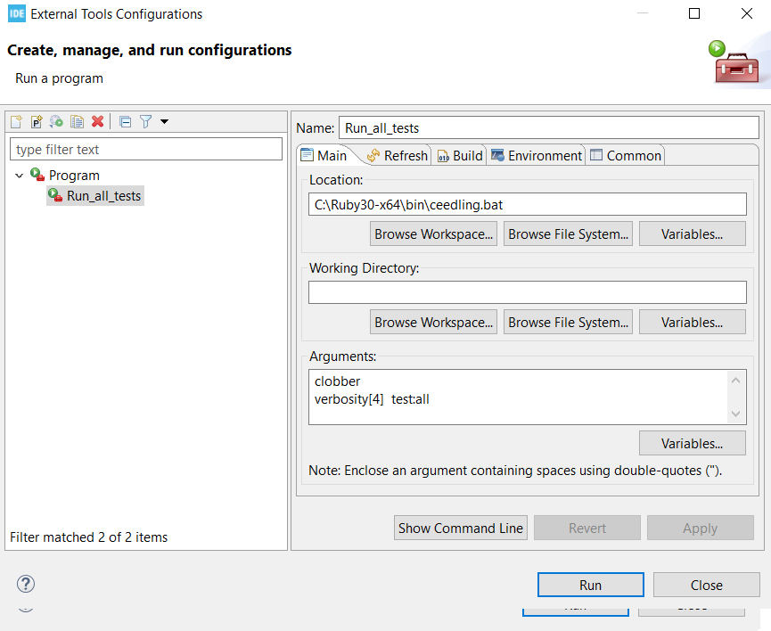
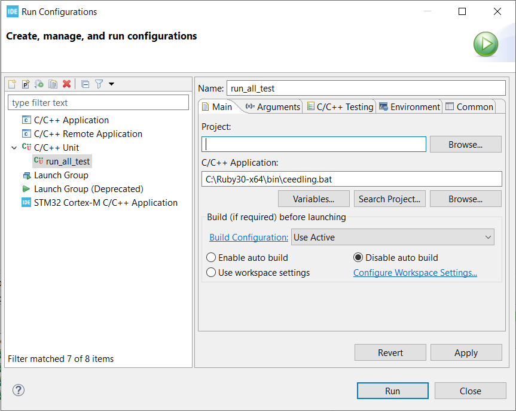
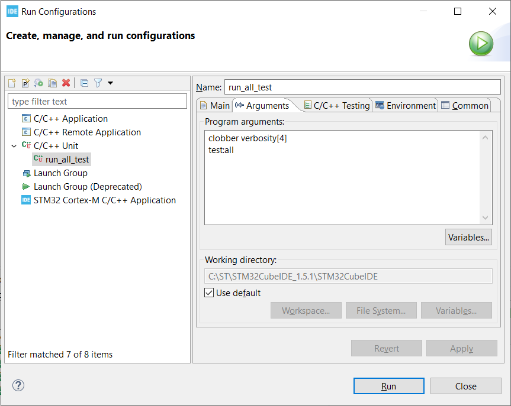
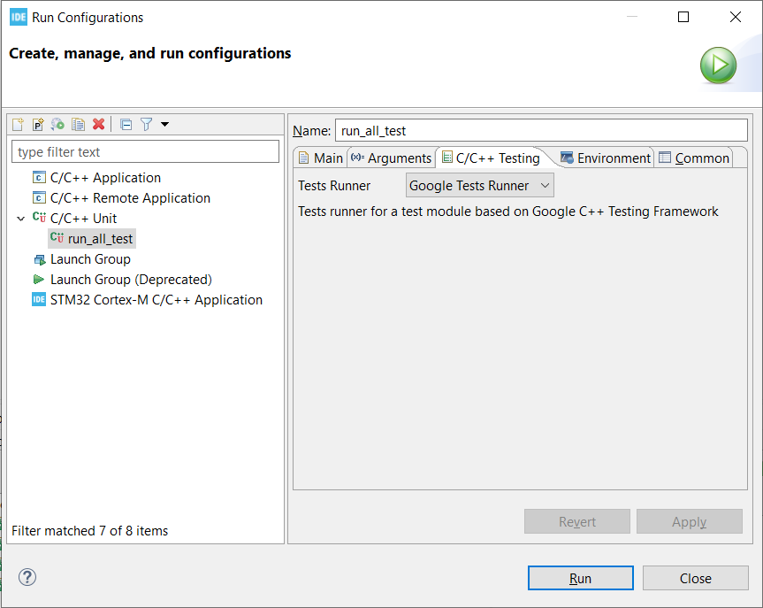
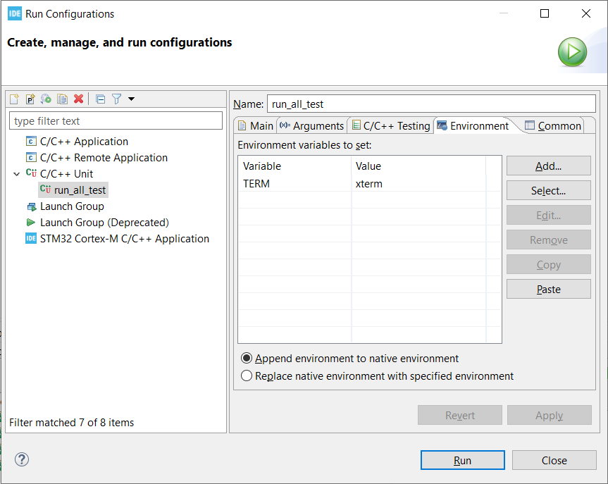

# Simple-allocator
Small project for simple memory allocator library. 

## Main concepts
Algorithm of allocation based on requesting some memory block from a static heap (memory pool). Size of requested block and heap is fixed on runtime, but could be configured via `BLOCK_SIZE` and `BLOCKS_IN_HEAP` before compilation.

The library interface has two functions:
```
void * mem_block_alloc(void); 		// Allocate one block of data.
void mem_block_free(void * block);	// Free one block of data.
```

For thread-safe usage user could define and write some implementation of two functions for atomic executions:
```
__begin_atomic_process();
__end_atomic_process();
```

## Tests
Library has some set of unit-tests, based on [Unity](http://www.throwtheswitch.org/unity) framework and [ceedling](https://github.com/ThrowTheSwitch/Ceedling) build system.

## Notes for running tests on embedded
There is always some challenge in running tests on embedded system. Here is main steps for reaching this (applies to Unity, ceedling and STM32CubeIDE):

1. Download `Unity` source framework.
2. Download and install `Ruby`.
3. Install `ceedling`.
```
gem install ceedling
```
On this step it could be one problem: version of `ceedling` doesn't correspond to version of `Ruby`, probably you need to decrease version of `Rubby`.

4. Generate testing environment in your STM32CubeIDE project with running next command from folder, where your project nests (e.g. your project directory name is `bar` and is located in directory `foo`, then run it from `foo` with argument `bar`):
```
ceedling new bar
```
This will make some environment folders and files, they could be placed in `.gitignore` if need.

5. Place `Unity` sources in your project with your `Src` and `Inc` folder agreements.
6. Configure `project.yml` with basics:
```
# Place here information about paths for sources and headers
:paths:
  :source:
    - Src/**
    - Inc

# For Eclipe and STM32CubeIDE recommended to correct this
:plugins:
  :enabled:
    #- stdout_pretty_tests_report
    - stdout_gtestlike_tests_report	
```

7. Create test cases for some module (e.g with name `myModule`). Run from project folder:
```
ceedling module:create[test_myModule]
```
Prefix `test` needs for `ceedling` to create unit-test source from template.

8. Implement a lot of tests!
9. Prepare IDE for running tests:
<p align="middle">
  
   
</p>

- In `Location` place path to `ceedling` running script or `.bat` file;
- In `Working directory` select your project;
- In `Arguments` place for clear all artifacts before building and then run all tests:
```
clobber verbosity[4]
test:all
```

10. Install `C/C++ unit testing support` software within STM32CubeIDE (Eclipse).
11. Prepare new `Run configuration`, here is example ([for more information](http://www.throwtheswitch.org/eclipse)):
<p align="middle">
  
   
</p>
<p align="middle">
  
   
</p>